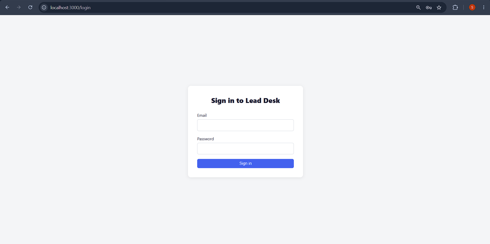
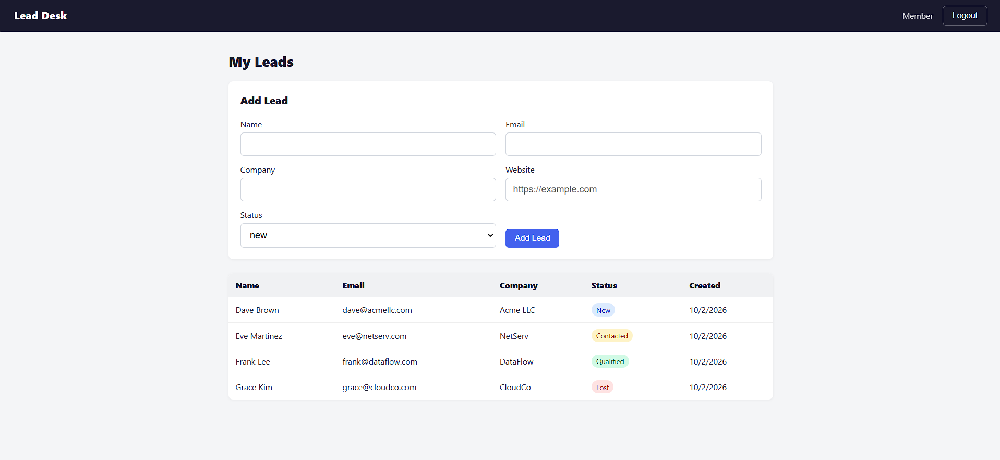
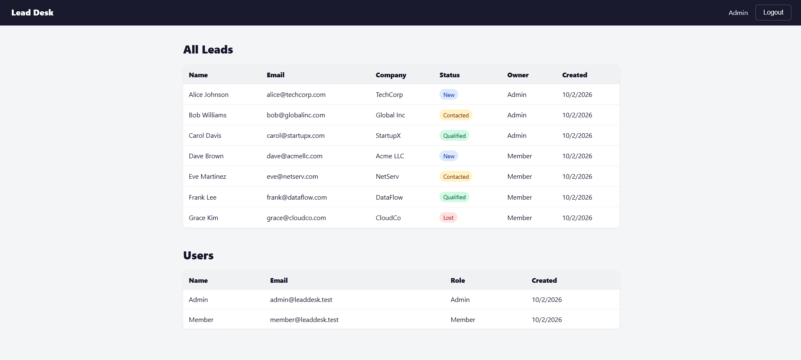

# Lead Desk

A full-stack web application for managing sales leads with secure JWT authentication and role-based access control. Users log in as either an **admin** (sees all leads and all users) or a **member** (sees and creates only their own leads). Authentication uses httpOnly cookie-based JWTs with automatic silent token refresh, refresh token rotation, and reuse detection. The entire stack runs with a single `docker compose up --build` command.

## Tech stack

| Layer | Choice | Why |
|-------|--------|-----|
| Backend | **FastAPI** (Python 3.12) | Async-capable, built-in request validation via Pydantic, clean dependency injection for auth guards |
| ORM | **SQLAlchemy 2.0** | Mature, supports explicit queries and relationships without magic |
| Migrations | **Alembic** | First-party SQLAlchemy migration tool, runs automatically on startup |
| Database | **PostgreSQL 16** | Reliable, supports CHECK constraints and transactional DDL for safe migrations |
| Frontend | **React 19 + Vite 6 + TypeScript** | Fast dev/build tooling, type safety, widely understood component model |
| HTTP client | **Axios** | Simple interceptor API for the silent token refresh logic |
| Routing | **React Router 6** | Declarative route guards with loader/redirect support |
| Reverse proxy | **Nginx (unprivileged)** | Serves the SPA and proxies `/api` to the backend on one origin, eliminating CORS entirely |
| Containerisation | **Docker Compose** | One-command startup with service ordering, healthchecks, and named volumes |

## Prerequisites

- [Docker](https://docs.docker.com/get-docker/) (v20+)
- [Docker Compose](https://docs.docker.com/compose/install/) (v2+)

No local Python, Node.js, or PostgreSQL installation is needed.

## Getting started

```bash
cp .env.example .env
docker compose up --build
```

Wait for all three services to become healthy (the frontend starts last). This takes about 30 seconds on the first run.

## URLs

| Service | URL |
|---------|-----|
| Frontend | http://localhost:3000 |
| Backend API | http://localhost:3000/api (proxied through Nginx) |
| Backend direct | http://localhost:8000 (useful for debugging) |

## Seed credentials

| Email | Password | Role | Home page |
|-------|----------|------|-----------|
| admin@leaddesk.test | Admin@123 | admin | /admin |
| member@leaddesk.test | Member@123 | member | /dashboard |

Each user also has 3-4 sample leads pre-seeded.

## Running tests

```bash
docker compose run --rm backend pytest
```

This creates a separate `leaddesk_test` database, runs all tests with table truncation between each test, and never touches the main `leaddesk` database. Add `-v` for verbose output.

## Environment variables

All configuration is in `.env` (copied from `.env.example`). No secrets are committed to the repository.

| Variable | Description |
|----------|-------------|
| `POSTGRES_USER` | PostgreSQL username |
| `POSTGRES_PASSWORD` | PostgreSQL password |
| `POSTGRES_DB` | PostgreSQL database name |
| `DATABASE_URL` | SQLAlchemy connection string used by the backend |
| `JWT_SECRET` | Secret key for signing JWT access tokens (required, no default) |
| `ACCESS_TOKEN_TTL_MINUTES` | Access token lifetime in minutes (default: 15; set to 1 to test refresh) |
| `REFRESH_TOKEN_TTL_DAYS` | Refresh token lifetime in days (default: 7) |
| `SECURE_COOKIES` | Set to `true` in production to add the Secure flag to cookies (default: false) |
| `BACKEND_PORT` | Host port mapped to the backend (default: 8000) |
| `FRONTEND_PORT` | Host port mapped to the frontend (default: 3000) |

## API endpoints

All endpoints use the `/api` prefix.

| Method | Endpoint | Access | Behaviour |
|--------|----------|--------|-----------|
| POST | /api/auth/login | Public | Validates email and password. Sets access and refresh tokens as httpOnly cookies. Returns the user object (no tokens in the body). |
| POST | /api/auth/refresh | Refresh cookie | Validates the refresh token, rotates it (old one revoked, new one issued). Reuse of a revoked token revokes all tokens for that user. |
| POST | /api/auth/logout | Logged in | Revokes the refresh token and clears both cookies. |
| GET | /api/auth/me | Logged in | Returns the current user (id, name, email, role). |
| GET | /api/leads | Logged in | Member: own leads only. Admin: all leads with the owner's name. Ordered by created_at desc. |
| POST | /api/leads | Logged in | Creates a lead owned by the current user. Validates name, email, company, website, and status. |
| GET | /api/admin/users | Admin only | Returns all users (never includes password hashes). A member gets 403. |
| GET | /api/health | Public | Returns 200 when the backend is up. Used by the Docker healthcheck. |

## Screenshots

**Login page**



**Member dashboard**



**Admin page**



## Assumptions

- **No CORS configuration**: Nginx reverse-proxies both the frontend and the API on a single origin (`localhost:3000`), so the browser never makes a cross-origin request. No CORS headers are needed.
- **Naive UTC timestamps**: All `datetime` values are stored as PostgreSQL `timestamp without time zone` and generated with `datetime.now(timezone.utc).replace(tzinfo=None)`. This avoids timezone-aware/naive comparison issues in SQLAlchemy while keeping all times in UTC.
- **Test database uses `create_all`**: The test suite creates tables via `Base.metadata.create_all` instead of running Alembic migrations. This is simpler for test isolation but means CHECK constraints from migration `0002` are enforced by the models/DB only if SQLAlchemy declares them. The models include matching `CheckConstraint` declarations so the schemas stay in sync.
- **`email-validator` rejects `.test` TLD**: The `.test` TLD is reserved per RFC 2606 and rejected by `email-validator`. The login endpoint accepts email as a plain string (not `EmailStr`) so the seeded `@leaddesk.test` accounts work. Lead creation uses `EmailStr` as required by the spec.
- **bcrypt pinned to 4.0.1**: `passlib 1.7.4` is incompatible with `bcrypt >= 4.1` due to a removed `__about__` attribute. Pinning bcrypt avoids the breakage.

## Explanation

### Auth flow
When a user logs in, the backend checks the email and password. Passwords are stored as bcrypt hashes. If the login is correct, the backend sets two httpOnly cookies: an access token (a JWT that lasts 15 minutes) and a refresh token (a random string that lasts 7 days). The refresh cookie is only sent to `/api/auth`. In the database I store only a SHA-256 hash of the refresh token, never the token itself.

When the access token expires, the frontend calls `/api/auth/refresh`. The backend gives back a new access token and a new refresh token, and marks the old refresh token as revoked. If someone sends an old refresh token again, the backend rejects it and revokes all active tokens for that user. On logout, the refresh token is revoked in the database and both cookies are cleared.

### Refresh handling
All frontend requests go through one Axios client. When a request gets a 401, the client calls refresh and then retries the request once. There is one shared "refresh in progress" promise. If many requests fail at the same time, they all wait for that same promise, so only one refresh call is made. This matters because a second refresh with the same token would look like a stolen token and log the user out. If the refresh fails, the user state is cleared and the user goes to `/login`. Login and refresh requests are skipped by this logic, so it cannot loop.

### Role-based access
Roles are checked on the backend. The `require_admin` dependency returns 403 when a member calls `/api/admin/users`, and 401 when the user is not logged in. For leads, members only get rows where `owner_id` is their own id. The owner of a new lead always comes from the logged-in user, never from the request body.

On the frontend, route guards redirect people: logged-out users go to `/login`, members who open `/admin` go to `/forbidden`, and after login an admin goes to `/admin` and a member to `/dashboard`. These redirects are only for a good user experience. The real protection is on the backend. On page reload, the app calls `/api/auth/me` to restore the session.

### Docker setup
The `db` service starts first and has a `pg_isready` healthcheck. The backend waits until the database is healthy. When it starts, it runs the Alembic migrations and the seed, then serves requests. `[check: migrations run in app startup]` Its healthcheck calls `/api/health`. The frontend starts after the backend. `[check: depends_on backend]` The backend runs as `appuser` and the frontend runs as the `nginx` user, so neither runs as root. The frontend image is built in two stages, and Nginx serves the built app and proxies `/api` to the backend. This keeps everything on one origin, so I did not need any CORS settings. The database port is not published to the host.

### Decisions and trade-offs
I chose FastAPI because validation and error handling are quick to write and easy to read. SQLAlchemy and Alembic give me a proper model and real migrations. On the frontend I used React with Vite and TypeScript, and Axios because its interceptors make the refresh logic simple.

With more time I would replace `python-jose` and `passlib` with PyJWT and `bcrypt` directly, because the tests show deprecation warnings from them. I would also run migrations in an entrypoint script instead of at app startup, and split the dev requirements (pytest, httpx) from the production ones.

### What is not finished
I did not do pagination, search, rate limiting, admin edit or delete for leads, frontend tests, or a CI workflow. The access token lifetime must be a whole number of minutes, so the 1-minute test works but fractions do not. `[check: the tests build their schema with create_all instead of running the migrations, so they do not test the migrations themselves. Delete this sentence if you switched to alembic.]`

### AI tools
I used Claude Code to write much of the code.
